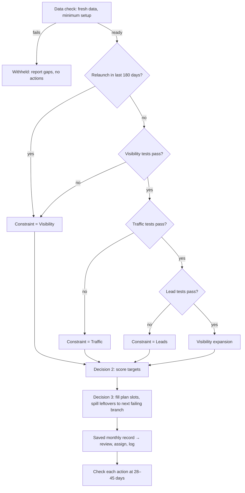

# OrganicIQ Decision Engine — Triage Spec

Version: 2026-10-09 · Owner: Ryan Shelley (SMA Marketing)

## 1. Purpose and principles

Each month the engine names **one primary constraint** (Visibility, Traffic or Leads), picks the highest-value targets inside it, and prescribes as many growth actions as the client's plan allows, each under an hour. The baseline work runs every month regardless. The engine only decides where the next marginal hour goes.

1. **Upstream first.** Visibility gates Traffic, and Traffic gates Leads. A downstream branch becomes the constraint only when every branch above it passes.
2. **One constraint per month.** It gets the action slots first. Slots it cannot fill go to the next *failing* branch, never to a branch that passes or is blocked.
3. **The plan sets the action count.** Launch and legacy = 1, Lift = 3, Lead = 5, Enterprise = 5 or more. Never exceed it. Never pad it.
4. **Managed channels only.** All rates use `organic_search` and `ai_referral` sessions (per `channel_rules`).
5. **No data, no rule.** Every rule declares its inputs. If an input is missing the rule does not fire and the output names the gap. Never fall back to guessing from URL fragments.
6. **Evidence on every action.** Each prescription cites the rows that triggered it.
7. **Close the loop.** Every action is logged with a metric and a check date. The same action is not prescribed on the same URL again before its check date.

## 2. The monthly run

The baseline (not engine output): new content, decaying-content updates, technical SEO, on-page review of main navigation pages, Google Business Profile upkeep, content link promotion, data analysis.

All three branches' tests always run (spillover needs every branch's status). The first failing branch in order is the constraint.

## 3. Decision 1 — pick the constraint

A branch **fails** if any of its tests fails. It is **blocked** if any test lacks its input and none fails. It **passes** otherwise. Thresholds are defaults; store them as `decision_thresholds` keys for per-client tuning.

- **Override:** a relaunch, migration or domain change logged in `annotations` within 180 days forces Visibility.
- **Hysteresis:** a constraint holds at least 2 months; it releases early only when every one of its tests clears its pass line by 10%.
- **Incidents are not growth actions:** zero lead events for 14 days after a history of leads, a >20% drop in indexable pages, or a site-wide technical fault (e.g. schema that names the wrong brand) goes to the technical baseline as an incident. It does not use a slot and does not change the constraint.

### Visibility tests

| Test | Fails when (default) | Source |
| --- | --- | --- |
| V1 Priority-term coverage | < 30% of priority-group keywords rank top 10 | `facts_ser_keywords` |
| V2 Visibility trend | `visibility_percent` falls > 15% over 90 days | `facts_ser_site_summary` |
| V3 Impression trend | Managed GSC impressions, last 28 days vs prior 28, fall > 15% | `facts_gsc_daily` |
| V4 Priority-page reach | Any page in `client_conversion_pages` or `keyword_targets` has no term in top 20 | `facts_ser_keywords`, `facts_gsc_query_pages` |
| V5 AI answer presence | Brand mentioned in < 20% of tracked prompts, or `ai_sov` falls > 25% over 90 days | `facts_ser_ai_prompts` |

### Traffic tests

| Test | Fails when (default) | Source |
| --- | --- | --- |
| T1 Missed clicks | Missed clicks > 20% of actual organic clicks | `facts_gsc_pages` |
| T2 Divergence | Impressions up > 10% while managed sessions flat or down (28 days) | `facts_gsc_daily`, `facts_ga4_traffic` |
| T3 Engagement quality | Engaged-session rate < 50%, or < 80% of client's 6-month median | `facts_ga4_traffic` |

Missed clicks per page: `missed_p = impr_p × max(0, CTR_exp(pos_p) − CTR_p)`. Expected CTR by whole position comes from the client's own 16-month GSC curve; if the client has < 5,000 clicks in that period, use the pooled curve across clients.

### Lead tests

| Test | Fails when (default) | Source |
| --- | --- | --- |
| L1 Goal pace | Leads month-to-date < 80% of pro-rated `monthly_lead_goal` | `facts_ga4_events`, `conversion_definitions`, `clients` |
| L2 Lead rate | Managed lead rate < 80% of baseline `lead_rate_pct` | same + `clients.baseline` |
| L3 Next-step flow | > 50% of managed sessions land on top-of-funnel pages with no in-content link to a mid/bottom-funnel page | `facts_crawl_internal_links`, `client_conversion_pages` |

No `conversion_definitions` → Leads is **blocked**, never passed.

### Everything passes

Constraint = **Visibility expansion**: the next tier of keyword groups or untracked AI prompts become visibility targets.

## 4. Decision 2 — pick the targets

Score every candidate in the branch; keep one target per available slot. Scores are products, so a zero on any factor removes the candidate.

### Visibility: keyword–page pairs

Candidates: priority-group keywords (`facts_ser_keywords`), GSC queries at positions 4–30 (`facts_gsc_query_pages`), AI prompts where `brand_mentioned = false` (`facts_ser_ai_prompts`).

`score = volume × w_intent × w_group × reach(pos, KD) × fit`

| Factor | Rule (default) |
| --- | --- |
| Intent | Commercial/transactional 1.0, informational 0.4 |
| Group | Priority group (e.g. GEO) 1.5, other tracked groups 1.0 |
| Reach | Pos 4–10: 1.0 · 11–20: 0.8 · 21–30: 0.5 · unranked: 0.3 × (1 − KD/100) if KD known, else 0.15 · pos 1–3: 0.1 |
| Fit | 1.0 ranking URL = mapped target · 0.5 another URL ranks (also flags V-6) · 0.7 no mapping yet |

Prompt candidates use the prompt's `search_volume`, intent 1.0 when a competitor is cited and the client is not.

### Traffic: pages

Candidates: pages with ≥ 200 managed impressions in 28 days.
- **CTR targets:** missed clicks × page weight (service/conversion pages 1.5, articles 1.0).
- **Audience mismatch:** engaged rate < 60% of site median and top queries informational; rank by sessions × engagement gap.
- **Bot filter:** drop pages with engaged rate < 10% and a > 3× week-over-week session spike; report as a data-quality note.

### Leads: landing pages

Candidates: landing pages with **≥ 100 managed sessions** in 28 days. A candidate below the minimum may only be used if nothing else qualifies, and must carry a `small_sample` flag and lower the run's confidence.
- **Low-rate pages:** sessions × (site median lead rate − page lead rate) × `lead_value` (omit the last factor when null).
- **Dead-end pages:** top-of-funnel pages with no in-content link (`in_content = true`, `is_template = false`) to a mid/bottom-funnel page.
- **No-CTA pages:** `conversion_elements = 0` in the crawl.

Lead rate is by landing page ("landed here, converted anywhere"): a routing signal, not proof the page converts.

## 5. Decision 3 — prescribe the actions

### Slots by plan

| Plan | Growth actions / month |
| --- | --- |
| Launch (and legacy) | 1 |
| Lift | 3 |
| Lead | 5 |
| Enterprise | 5 or more (default 5; per-client override in `clients`) |

Slot filling, in order:
1. Fill from the constraint's targets in score order.
2. Leftover slots go to the next **failing** branch in Visibility → Traffic → Leads order (`spillover = true`). Blocked or passing branches cannot take slots.
3. One action per URL per month.
4. If the failing branches together have fewer qualifying targets than slots, return fewer actions. Empty slots are shown as empty with the reason.

### Action catalog

Within a branch, the first action whose trigger fires for a target is used.

| ID | Action (verb-first title) | Trigger | Data | Done when | Measured by (check) |
| --- | --- | --- | --- | --- | --- |
| V-1 | Place the target term in high-value spots | Term missing from title, meta description or every H2 | crawl `title`, `description`, `sections` | Term in title, one H2, first 100 words | Term position (28 d) |
| V-2 | Add an answer block / FAQ with FAQPage markup | Prompt/question query has no match in `faq_questions` | `facts_ser_ai_prompts`, `facts_gsc_query_pages`, crawl | 40–60-word direct answer under a question heading, marked up | Brand mention/citation (30 d) |
| V-3 | Add entity markup | No `about`/`mentions` for the term's entity | `facts_crawl_page_schema` | `about`/`mentions` + Wikidata `sameAs` where one exists | Position + AI citation (45 d) |
| V-4 | Add internal links to the target | `inbound_editorial_links` below site median | `facts_crawl_internal_links` | 2–3 in-content links with term/variant anchors | Term position (28 d) |
| V-5 | Add an extractable structure | No table/list/numbers near the answer and SERP shows AI Overview/snippet | crawl format flags + SERP pull | Table, bullet summary or stat block under matching heading | AI citation + position (30 d) |
| V-6 | Raise a re-homing ticket | Term ranks on a non-target URL or on 2+ URLs | `ranking_url`, `keyword_targets` | Decision: keep, move, or build (build → content queue) | Decision only |
| T-1 | Rewrite title and meta description | Page in top 3 for missed clicks | `facts_gsc_pages` | Title ≤ 60 chars with term and reason to click; old version logged | CTR vs expected (28 d) |
| T-2 | Match the SERP format | Feature present that client doesn't hold | SERP pull | Format block added via V-2/V-5 method | Feature won, CTR (30 d) |
| T-3 | Realign the page to the audience | Audience-mismatch target | `facts_gsc_query_pages`, `facts_ga4_traffic` | H1 + intro rewritten for the ideal customer | Engaged rate (28 d) |
| L-1 | Route readers to the next step | Dead-end target | `facts_crawl_internal_links`, `client_conversion_pages` | In-content link + short pitch to best mid/bottom page | Leads from sessions starting there (30 d) |
| L-2 | Add or move a call to action | `conversion_elements = 0` or none in first section | crawl | One CTA in the first screen, matched to the topic | Landing-page lead rate (30 d) |
| L-3 | Match the offer to the topic | Generic offer while a topic-matched offer exists | `client_conversion_pages` | Offer swapped, CTA text rewritten | Lead rate (45 d) |

V-2, V-3 and V-5 are the GEO layer.

## 6. Output contract

One record per client per month. The client page renders this record; it is saved, not recomputed on view. Full JSON Schema: `schema/monthly-record.schema.json`. Example: `schema/example-record.aquaman.json`.

Key fields: `client`, `month`, `run_saved_at`, `data_through`, `plan`, `action_slots`, `constraint`, `reason`, `held_since`, `confidence` + `confidence_reasons[]`, `branches[]` (each with tests: id, name, metric label, value, pass line, direction, status), `actions[]` (slot, id, title, branch, spillover, target_url, term, score, effort_min, why, done_when, metric, check_on, flags[], plus workflow fields `assignee`, `due`, `status`, `skip_reason`), `empty_slots[]`, `incidents[]`, `not_this_month[]`, `data_gaps[]`, `previous_results[]`.

**Confidence:** high = every input for the chosen rules present and fresh; medium = a fallback was used (pooled CTR curve, no target mapping); low = a core input is missing or questionable (e.g. a lead goal far above baseline, a small-sample target). Low confidence still shows actions but leads with "Check before you assign" items. If the data check fails entirely the client is **Withheld** and no actions are produced.

### Suppression rules

- Skip URLs in `refresh_queue`.
- Skip URLs that are not indexable, redirect, or soft-404 → send to the technical baseline.
- One action per URL per month; no repeat of the same action on the same URL before its check date.
- No run if Search Console or GA4 data is > 7 days stale → Withheld, name the stale source.
- Never pad the list.

## 7. Data readiness (from the 8 Oct 2026 inventory, 24 clients)

| Rule or action | Needs | Status |
| --- | --- | --- |
| V1, V2, V4 | SE Ranking keywords, groups, site summary | Ready |
| V3, T2 | GSC daily, GA4 traffic | Ready |
| V5 | `facts_ser_ai_prompts` | Ready where prompts are tracked |
| Fit score, V-6 | `keyword_targets` | Blocked: table does not exist (0/24) |
| Unranked reach | Keyword difficulty | Partial (2/24) |
| V-1 | crawl `sections` | Partial (1/24, re-crawls rate-limited) |
| V-2, T-3 | `facts_gsc_query_pages`, crawl `faq_questions` | Partial (4/24 queries, 1/24 FAQs) |
| V-3 | `facts_crawl_page_schema` | Ready; parse `about`/`mentions` out of stored JSON-LD |
| V-4, L-1 | `facts_crawl_internal_links` | Ready |
| V-5, T-2 | All SERP features, held or not | Blocked (only won features stored) |
| T1, T-1 | `facts_gsc_pages` | Ready |
| L1, L2 | `conversion_definitions`, goal, baseline | Partial (4/24) |
| L3, L-1, L-3 | `client_conversion_pages` | Partial (1/24) |
| L-2 position | CTA position on page | Blocked (crawl stores a count) |
| Scroll / conversion page | GA4 `pagePath`, scroll events | Blocked |
| Dollar values | `clients.lead_value` | Blocked (null everywhere) |

## 8. Data pull backlog

| P | Change | Type | Unblocks |
| --- | --- | --- | --- |
| P1 | Fill `conversion_definitions` for all clients | Config | Lead branch |
| P1 | New `keyword_targets` table (keyword, target_url, role primary/secondary, group, priority) | Schema + config | Fit, V-1, V-6, V4 |
| P1 | Run the existing GSC `query×page` request for all clients; find why 20 are empty | Fix | V-2, T-3, V4 |
| P1 | Re-crawl with `sections` + `faq_questions`: 1–2 concurrent, back off on 429, honour `Crawl-delay` | Fix | V-1, V-2 |
| P1 | Fill `client_conversion_pages` with stage tags | Config | L3, L-1, L-3 |
| P2 | Monthly on-demand SERP pull, top 20 targets per client, store every feature | New pull (credits) | V-5, T-2 |
| P2 | Monthly `keywords/export` for target terms missing difficulty | Existing endpoint | Reach for unranked |
| P2 | GA4: add `hostName`; second events request with `pagePath` + `eventName`; add `userEngagementDuration` | Request change | Subdomains, conversion page, time on page |
| P2 | Scroll depth: 25/50/75% custom events or TrueTrack (GA4 native fires only at 90%) | Tracking | CTA-reach diagnostics |
| P2 | Crawler: per-section table/list/number flags; first-CTA position; parse `about`/`mentions` | Crawler | V-3, V-5, L-2 |
| P3 | Log relaunches/migrations in `annotations` | Config | Override |
| P3 | `engine_actions` log (see schema) | Schema | Results loop, tuning |
| P3 | Wire `refresh_queue` to content production | Integration | Suppression |
| P3 | Set `clients.lead_value` | Config | Dollar figures |

## 9. Minimum setup per client

The engine runs only when all are present; otherwise the client is Withheld with the list.
- GSC pages and `query×page`
- GA4 traffic and events with `conversion_definitions`
- SE Ranking project with keyword groups, one marked priority
- `keyword_targets` for ≥ 10 priority terms
- ≥ 1 page in `client_conversion_pages` with stage
- Crawl within 35 days including `sections` and `faq_questions`
- `monthly_lead_goal` and baseline in `clients`

## 10. Rollout

1. Weeks 1–2: P1 backlog; load default thresholds into `decision_thresholds`.
2. Weeks 3–4: Visibility in shadow mode for SMA + the 3 fully-instrumented clients.
3. Month 2: Visibility live, Traffic shadow; `engine_actions` logging starts.
4. Month 3: Traffic live, Leads shadow (needs GA4 P2 changes).
5. Month 4+: all live; tune thresholds from 90 days of outcomes.

## 11. Open questions

- Who owns `keyword_targets` per client: SEO lead or account manager?
- Should a severe downstream failure (e.g. lead rate < 50% of goal) jump the upstream order? This spec says no.
- TrueTrack or GA4 custom events for scroll/CTA reach?
- Monthly credit budget per client for SERP pulls and `keywords/export`?
- Clients that will never set up lead tracking: switch the Lead branch off, or flag monthly?
